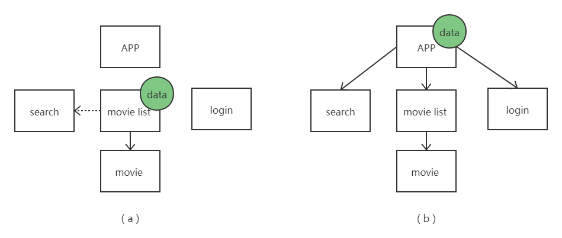
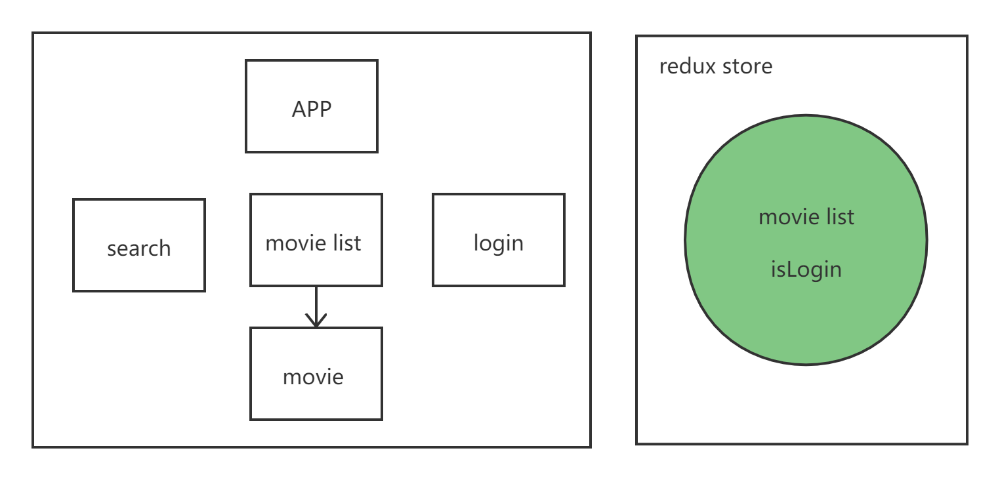

Redux 入门课程笔记

---

Reference :  [video source](https://www.youtube.com/watch?v=CVpUuw9XSjY)

Reops : [helloredux](https://github.com/zzusunjs/helloredux) 

Redux 为大型复杂 React 应用的状态管理而生，由于 React 的单向数据流特性，React 应用中组件无法访问其兄弟组件的数据。而为了实现兄弟组件之间的数据访问只能采取 “状态提升” 的方法，但是对于复杂应用而言，将所有数据都放在最顶层组件显然容易引起混乱，缺失逻辑上的美感。这就是 Redux 诞生的前提，一个单向数据流导致复杂的 React 应用的数据管理是杂乱不堪的。

一个带有登录，搜索，展示电影功能的 APP 的组件设计可以如下图中（a）所示，电影列表数据位于 movie list 组件中，但是同层的 search 组件和 login 组件无法直接获得 movie list 数据，而有些功能是需要获取兄弟组件的数据的，如 search 组件可以根据 movie list 数据做模糊查询的匹配等。图中（b）部分是一种 “状态提升” 的解决方案，通过将数据放到顶层组件来避免兄弟组件之间的数据访问。 



Redux 单独将数据储存在 store 中，从 React 组件中剥离出来，通过 action (描述数据变化的对象)，reducer (实际改变数据的逻辑)，store (数据存储) 来标准化数据的修改过程，同时也延顺了 React  的单项数据流的逻辑。通过在全局层面与 React 组件树中组件的 state 建立联系，Redux 实际上接管了整个应用的数据，将 React 组件中的 state 变为单纯的 “发言人”，甚至直接消除了父子组件之间，兄弟组件之间的数据通信问题。



Redux 本身的 API  是较为简单的，我们可以通过代码来进行学习。首先使用 create-react-app 创建一个项目，然后简化 APP.js 中的内容，安装 redux 以及 react-redux

```jsx
// npx create-react-app reduxapp
// yarn add redux react-redux

import React from 'react';
import ReactDOM from 'react-dom';
import './index.css';
import App from './App';

import {createStore} from 'redux';

// REDUCER
const counter = (state = 0, action) => {
  switch(action.type){
    case 'INCREASEMENT':
      return state + 1;
    case 'DECREASEMENT':
      return state - 1;
    default:
      return state;
  }
}

// ACTION
const increasement = () => {
  return {
    type: "INCREASEMENT"
  }
}

const decreasement = () => {
  return {
    type: "DECREASEMENT"
  }
}

// STORE
const store = createStore(counter);

// subscribe 类似于 vue 中的 watch 函数，监听变化
store.subscribe(()=>{console.log(store.getState())});

store.dispatch(increasement());
store.dispatch(decreasement());
store.dispatch(decreasement());

ReactDOM.render(
  <React.StrictMode>
    <App />
  </React.StrictMode>,
  document.getElementById('root')
);
```

如上面代码所示，action 部分仅仅是一些返回对象的函数，返回的对象描述了某一种行为，当然除了 type ，还可以添加 payload 记录参数。而 reducer 部分就是实际执行行为的部分，通过 `createStore` `subscribe` `getState` `dispatch` 等API 可以创建 store ，订阅 store 变化，获得 store 中的数据，以及向 reducer 传递 action 对象。

当然，我们使用 Redux 最终还是要方便 React 应用的开发，下面我们就介绍如何将 Redux 中的 store 连接到 React 。一般而言，可以在 `src` 文件夹下建立两个目录 actions 和 reducers，其中 actions 文件夹下可以只有一个 index.js ，导出不同的 action 函数即可；reducers 文件夹下一般可以有多个 reducer ，每个 reducer 处理一个组件或者一个数据的更新，最后通过 reducers/index.js 中的 `combineReducers` 合并所有 reducer 并传递给 `createStore`  。

截止到这里，我们已经完成了 Redux层面的所有准备，接下来需要将 Redux 的 store 和 React 的 state 联系起来。我们可以使用 react-redux 提供的 Provider 组件来建立联系，使用 Provider 组件包含 React 应用的根组件，并在 props 中传递 store 即可建立联系。当任意组件需要获取数据的时候，只需使用 react-redux 的 `useSelector` 方法，并向其传入筛选的函数，即可获得某个被关注的数据，具体情况可以查看[代码仓库](https://github.com/zzusunjs/helloredux)。同样，当需要更新数据的时候，只要使用 react-redux 的 `useDiapatch` 方法，并向其传入 action 函数即可。

  到此为止，我们已经借助 react-redux 完成了 redux 中 store 和 react 中 state 的绑定，敬请期待 redux 的其他高深用法。

---


